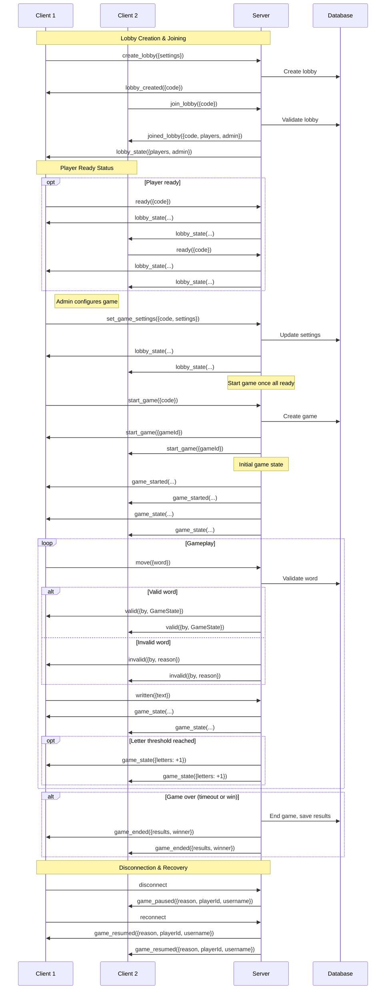

# Guessing Game Backend

An Express based backend for the word guessing game hosted at: [awindyend.com](https://awindyend.com)

## The Game

In this game each player gets a set of letters (starting with 1 and can go up to 4 during the game).
Each player then types all of the words that he can think of that contain all of the letters in his set.
For each correct word he guesses he gets a point.
After a player reaches 10 points (default is 10, can be changed in the settings), all the other players in the game recieve another letter to their set which they then must use.
The game can end in one of 2 ways:
- The time runs out (default game duration is 2 minutes but this can also be changed in the settings)
- A player has reached the victory threshold set in the settings

## Features

- Single-player game (with configurable settings)
- Multi-player game (only the creator of the lobby is allowed to change settings)
- Social network ->
  - Register or Log in
  - Add players as friends and invite them to 1v1s
  - Chat with friends (WIP)
  - See who is online

## Tech Stack


## Build and Run

1. Clone the repository
2. Install dependencies - ```pnpm i```
3. Run - ```node server.js```
  
## ENV Variables
Create an ```.env``` file in the root directory with the following values
- JWT_SECRET="yourSecret"
- PORT=8080
- HTTPS_PORT=442
- SSL_KEY_PATH=C:\foo\bar\name.key
- SSL_CERT_PATH=C:\foo\bar\name.cert
 
## Structure

### Models
- **User** -> contains all of the regular data plus friends array, incoming friend requests array, and outgoing friend requests array.
- **Guest** -> contains only name and id, used only to allow the server to identify non authenticated users
- **Game** -> contains gameCode field, all of the game settings as fields, players array where each object contains a reference to a user and the current state of this user in this game (points, letters, etc...), game state and winner
- **Chat** -> contains participants array, lastMessage which is populated automatically by the schema via middleware and message count
- **Message** -> contains the id of the parent chat, sender, content, readBy and editedAt

### Main flow:


### Routes

#### Authentication Routes (`/api`)
- **POST** `/register` - Register a new user account
  - Body: `{ username, email, password }`
  - Returns: `{ token, user: { id, username, email } }`
- **POST** `/login` - Authenticate user and get JWT token
  - Body: `{ email, password }`
  - Returns: `{ token, user: { id, username, email } }`
- **GET** `/user` - Get authenticated user profile (requires auth)
  - Headers: `Authorization: Bearer <token>`
  - Returns: User object without password
- **POST** `/logout` - Logout user and update online status (requires auth)
  - Headers: `Authorization: Bearer <token>`
  - Returns: `{ message: "Logged out successfully" }`
- **GET** `/guestId` - Generate temporary guest ID for non-authenticated users
  - Returns: `{ guestId }`

#### Friends Routes (`/api/friends`)
- **GET** `/` - Get all friends for authenticated user
  - Headers: `Authorization: Bearer <token>`
  - Returns: Array of friend objects with username, email, isOnline, lastActive
- **POST** `/add/:userId` - Send friend request to another user
  - Headers: `Authorization: Bearer <token>`
  - Params: `userId` - ID of user to send request to
  - Returns: Success message
- **POST** `/accept/:userId` - Accept incoming friend request
  - Headers: `Authorization: Bearer <token>`
  - Params: `userId` - ID of user whose request to accept
  - Returns: Success message
- **POST** `/decline/:userId` - Decline incoming friend request
  - Headers: `Authorization: Bearer <token>`
  - Params: `userId` - ID of user whose request to decline
  - Returns: Success message
- **POST** `/cancel/:userId` - Cancel outgoing friend request
  - Headers: `Authorization: Bearer <token>`
  - Params: `userId` - ID of user to cancel request to
  - Returns: Success message
- **GET** `/requests/incoming` - Get all incoming friend requests
  - Headers: `Authorization: Bearer <token>`
  - Returns: Array of user objects who sent requests
- **GET** `/requests/outgoing` - Get all outgoing friend requests
  - Headers: `Authorization: Bearer <token>`
  - Returns: Array of user objects to whom requests were sent
- **DELETE** `/remove/:userId` - Remove friend from friend list
  - Headers: `Authorization: Bearer <token>`
  - Params: `userId` - ID of friend to remove
  - Returns: Success message
- **GET** `/suggestions` - Get friend suggestions (friends of friends + random users)
  - Headers: `Authorization: Bearer <token>`
  - Query: `page`, `limit` (optional)
  - Returns: `{ suggestions: [], pagination: {} }`
- **GET** `/online` - Get online friends only
  - Headers: `Authorization: Bearer <token>`
  - Returns: Array of online friend objects
- **GET** `/find` - Search for users by username
  - Headers: `Authorization: Bearer <token>`
  - Query: `username`, `page`, `limit` (optional)
  - Returns: `{ users: [], pagination: {} }`

#### Chat Routes (`/api/chats`)
- **GET** `/` - Get all chats for authenticated user
  - Headers: `Authorization: Bearer <token>`
  - Returns: Array of chat objects
- **GET** `/messages` - Get messages for a specific chat (with pagination)
  - Headers: `Authorization: Bearer <token>`
  - Query: `chatId`, `page`, `limit`
  - Returns: Array of message objects

#### Game Routes (`/api/game`)
- **POST** `/validate` - Validate if a word is valid with given letters
  - Body: `{ word, letters }`
  - Returns: `{ success: boolean, reason?: string }`
- **GET** `/next-combos` - Get next tier letter combinations for game progression
  - Query: `letters` (optional, defaults to "root")
  - Returns: Array of letter combinations

### Socket.IO Events
The backend handles real-time communication through Socket.IO for:

#### General Events
- **`ping`** - Client heartbeat ping
  - Client emits: `socket.emit('ping')`
  - Server responds: `socket.emit('pong')`
- **`status_change`** - Manual status change from client
  - Client emits: `socket.emit('status_change', { isOnline: boolean })`
- **`disconnect`** - Client disconnection handling

#### Friend System Events
- **`manual_friend_accept`** - Manual friend request acceptance
  - Client emits: `socket.emit('manual_friend_accept', { userId, username })`
- **`friend_list_update_request`** - Request friend list update
  - Client emits: `socket.emit('friend_list_update_request')`
  - Server responds: `socket.emit('friend_list_update')`
- **`request_friends_status`** - Request friends' online status
  - Client emits: `socket.emit('request_friends_status')`
  - Server responds: `socket.emit('friend_status_change', { userId, isOnline, lastActive })`
- **`friend_request`** - New friend request notification
  - Server emits: `io.to(socketId).emit('friend_request', { fromUser, timestamp })`
- **`friend_list_update`** - Friend list updated
  - Server emits: `io.to(socketId).emit('friend_list_update')`
- **`friend_status_change`** - Friend online/offline status
  - Server emits: `io.to(socketId).emit('friend_status_change', { userId, isOnline, lastActive })`
- **`friend_removed`** - Friend removed notification
  - Server emits: `io.to(socketId).emit('friend_removed', { userId, username, timestamp })`

#### Game Invitation Events
- **`game_invite`** - Send game invitation
  - Client emits: `socket.emit('game_invite', { targetUserId })`
  - Server emits: `io.to(targetSocketId).emit('game_invite', { senderId, senderUsername })`
- **`game_invite_accept`** - Accept game invitation
  - Client emits: `socket.emit('game_invite_accept', { senderId })`
  - Server responds: `socket.emit('game_init', { gameId, opponents })`
- **`game_invite_error`** - Game invitation error
  - Server emits: `socket.emit('game_invite_error', { message })`

#### Lobby Events
- **`create_lobby`** - Create new game lobby
  - Client emits: `socket.emit('create_lobby', { settings })`
  - Server responds: `socket.emit('lobby_created', { code })`
- **`join_lobby`** - Join existing lobby
  - Client emits: `socket.emit('join_lobby', { code })`
  - Server responds: `socket.emit('joined_lobby', { code, players, admin })`
- **`ready`** - Player ready status
  - Client emits: `socket.emit('ready', { code })`
- **`unready`** - Player unready status
  - Client emits: `socket.emit('unready', { code })`
- **`set_game_settings`** - Update game settings (admin only)
  - Client emits: `socket.emit('set_game_settings', { code, settings })`
- **`leave_lobby`** - Leave lobby
  - Client emits: `socket.emit('leave_lobby', { code })`
- **`start_game`** - Start game (admin only)
  - Client emits: `socket.emit('start_game', { code })`
  - Server emits: `namespace.to(lobbyCode).emit('start_game', { gameId })`

#### Game Events
- **`move`** - Submit word move
  - Client emits: `socket.emit('move', { word })`
  - Server responds: `gameNamespace.to(gameId).emit('valid', { by: userId, GameState })` or `gameNamespace.to(gameId).emit('invalid', { by: userId, reason })`
- **`written`** - Update written text
  - Client emits: `socket.emit('written', { text })`
  - Server responds: `gameNamespace.to(gameId).emit('game_state', serializableGame)`
- **`game_started`** - Game started notification
  - Server emits: `gameNamespace.to(gameId).emit('game_started', { gameId })`
- **`game_state`** - Current game state update
  - Server emits: `gameNamespace.to(gameId).emit('game_state', serializableGame)`
- **`game_paused`** - Game paused (player disconnected)
  - Server emits: `gameNamespace.to(gameId).emit('game_paused', { reason, playerId, username })`
- **`game_resumed`** - Game resumed
  - Server emits: `gameNamespace.to(gameId).emit('game_resumed', { reason, playerId, username })`
- **`game_ended`** - Game ended with results
  - Server emits: `namespace.to(gameId).emit('game_ended', gameResults)`

#### Chat Events
- **`send_message`** - Send chat message
  - Client emits: `socket.emit('send_message', { friendId, message })`
  - Server responds: `socket.emit('message_sent', newMessage)`
  - Server broadcasts: `chatNamespace.to(friendId).emit('message_received', newMessage)`
- **`typing_start`** - Start typing indicator
  - Client emits: `socket.emit('typing_start', { friendId })`
  - Server broadcasts: `chatNamespace.to(friendId).emit('friend_typing', { userId })`
- **`typing_stop`** - Stop typing indicator
  - Client emits: `socket.emit('typing_stop', { friendId })`
  - Server broadcasts: `chatNamespace.to(friendId).emit('friend_stopped_typing', { userId })`
- **`mark_as_read`** - Mark message as read
  - Client emits: `socket.emit('mark_as_read', { messageId })`
  - Server broadcasts: `chatNamespace.to(senderId).emit('message_read', { messageId, readBy })`
- **`message_received`** - New message received
  - Server emits: `chatNamespace.to(friendId).emit('message_received', newMessage)`
- **`message_sent`** - Message sent confirmation
  - Server emits: `socket.emit('message_sent', newMessage)`
- **`message_read`** - Message read notification
  - Server emits: `chatNamespace.to(senderId).emit('message_read', { messageId, readBy })`
- **`friend_typing`** - Friend typing indicator
  - Server emits: `chatNamespace.to(friendId).emit('friend_typing', { userId })`
- **`friend_stopped_typing`** - Friend stopped typing
  - Server emits: `chatNamespace.to(friendId).emit('friend_stopped_typing', { userId })`

#### Error Events
- **`error`** - General error notification
  - Server emits: `socket.emit('error', { message })`
- **`invalid_lobby_code`** - Invalid lobby code
  - Server emits: `socket.emit('invalid_lobby_code', { code })`
- **`lobby_not_found`** - Lobby not found
  - Server emits: `socket.emit('lobby_not_found', { code })`
- **`not_admin`** - Not admin error
  - Server emits: `socket.emit('not_admin', { code })`
- **`invalid_game_settings`** - Invalid game settings
  - Server emits: `socket.emit('invalid_game_settings', { code, reason })`
- **`not_enough_players`** - Not enough players to start
  - Server emits: `socket.emit('not_enough_players', { code })`

### Authentication
All routes that require authentication use the `apiAuth` middleware and expect a JWT token in the `Authorization` header as `Bearer <token>`.

### Error Handling
All routes return appropriate HTTP status codes:
- `200` - Success
- `201` - Created (registration)
- `400` - Bad Request (validation errors)
- `401` - Unauthorized (invalid/missing token)
- `404` - Not Found
- `500` - Internal Server Error
